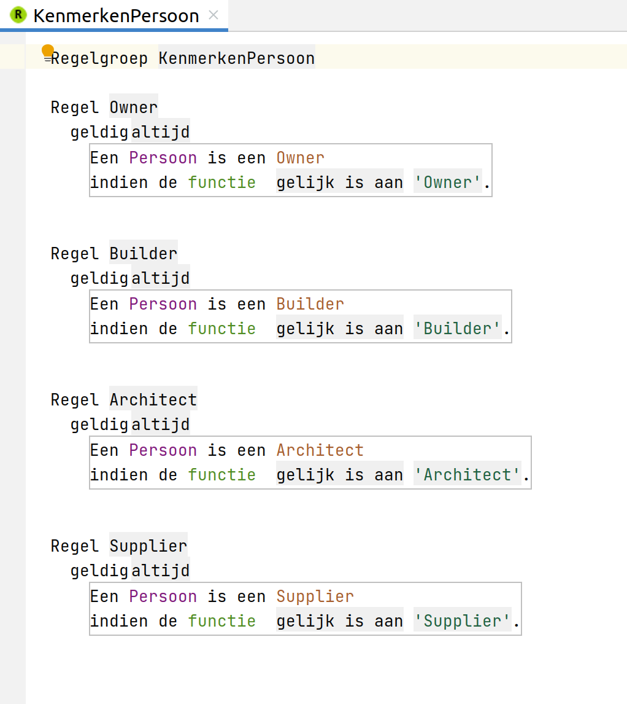
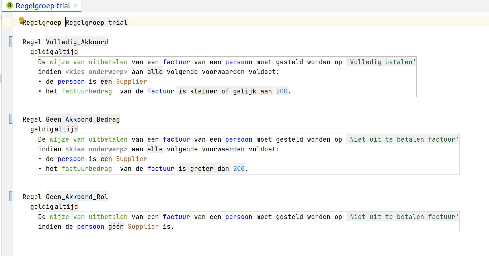
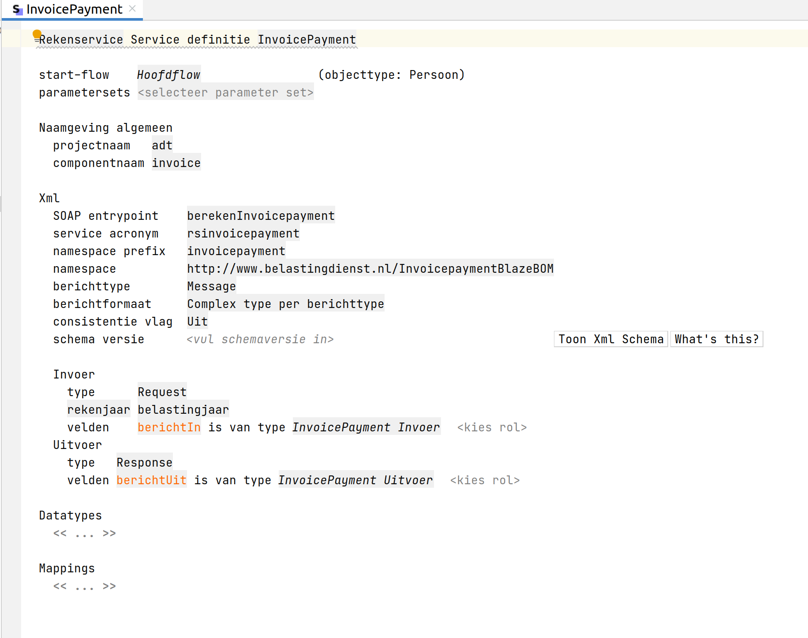
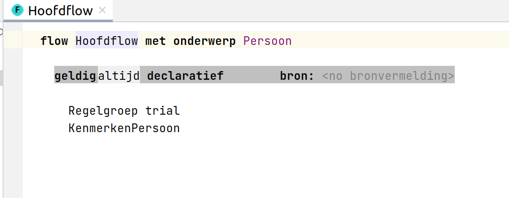
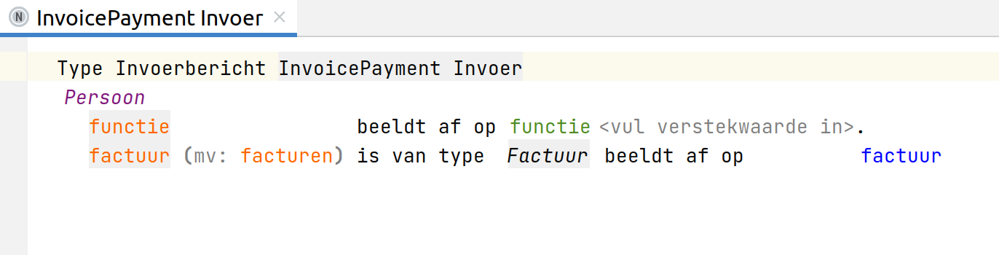
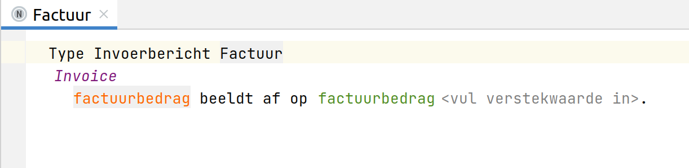
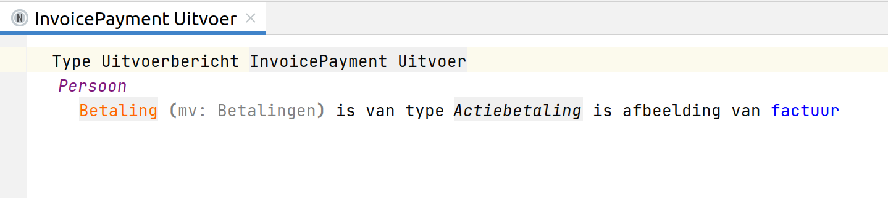
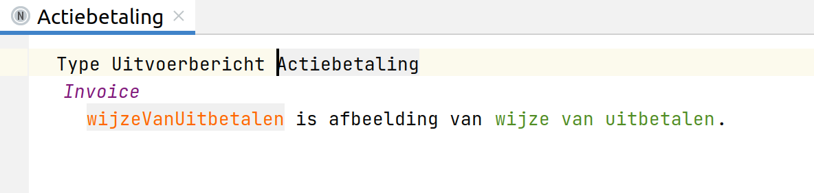

## Purpose

The goal of this demo project is to learn how to use the ALEF solution.

## ALEF

In the context of agile implementation of the law, the Tax and Customs Administration has developed a tool for drafting and testing rules.

This tool is called ALEF (Agile Law Execution Factory) and is based on Jetbrains MPS. In ALEF, specifications are drawn up in collaboration with the domain experts. These specifications consist of rules, data definitions and test cases. This is done as much as possible by the domain experts themselves. The rules are drawn up in the RegelSpraak language. This is a controlled Dutch language that is easy to read for lawyers as well as for computer systems.

## Use Case

The challenge is to realize a complete ALEF service for this very simple invoice payment use case:

A person submits an invoice for payment. The invoice must not exceed €200 and the person's position must be 'Supplier'. The result of the payment can be:
1. Reject
2. Pay in full
3. Pay in 3 equal parts over a 3 month period

If the amount is less than €100, full payout is possible. For the amounts between €100 and €200 we use the equal division in 3 installments. Optionally, it is an idea to round the payment in installments for the first two installments to whole euros.

The functions we recognize are:
- Owner
- Builder
- Architect
- Supplier

## Progress

Nov 11th 2021: Further elaborated with the help of Eric Bokhove. Note that the third option of the use case - pay in 3 equal parts - has not been specified in the elaboration thus far.  

Oct 29th 2021: Initial ALEF project created and first start made by , including a test case

We use the Dutch terms for convenience because they correspond to the screenshots of the ALEF editor.

### GEGEVENS
We start by specifying the data model.  

### REGELS
We then draw up the rules, whereby we first summarize the characteristics of the person in lines for the sake of readability.  

Now we use those attributes in the actual rules.  

### TEST
With the data model and the rules we can create test cases with which we can test the implementation of the rules against the use case requirements.  

### SERVICES
With successful test cases, we now also want to specify the service with which we can execute the rules. For this we need to create a service with an input and output message.  

### SERVICES - HOOFDLOW
But before we create the input and output messages, we must first determine the main flow, specifying the rules to be executed.  

### SERVICES - INVOERBERICHT
The input message contains the information to be tested about the person and the invoice. Note that this input message itself needs an InputMessageType (Services) that we also need to specify! In our case, that is the input message type **Factuur**.  

### SERVICES - UITVOERBERICHT
The output message contains the outcome of the verified input about the person and the invoice. Note that as with the input message, this output message itself again needs an OutputMessageType (Services) that we also need to specify! In our case, that is the output message type **Actiebetaling**.  

