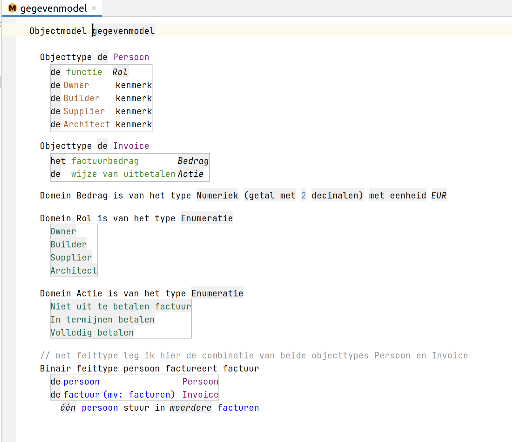
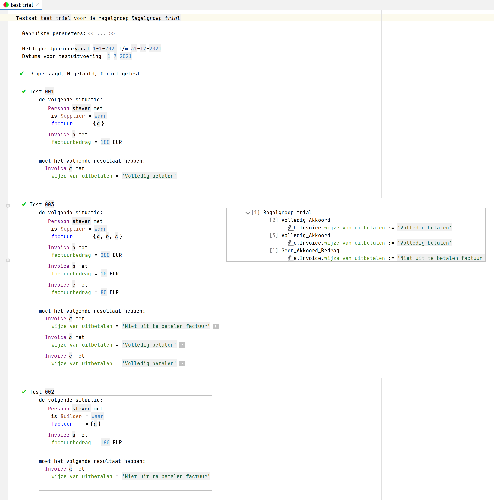

## Purpose

The goal of this demo project is to learn how to use the ALEF solution.

## ALEF

In the context of agile implementation of the law, the Tax and Customs Administration has developed a tool for drafting and testing rules.

This tool is called ALEF (Agile Law Execution Factory) and is based on Jetbrains MPS. In ALEF, specifications are drawn up in collaboration with the domain experts. These specifications consist of rules, data definitions and test cases. This is done as much as possible by the domain experts themselves. The rules are drawn up in the RegelSpraak language. This is a controlled Dutch language that is easy to read for lawyers as well as for computer systems.

## Use Case

The challenge is to realize a complete ALEF service for this very simple invoice payment use case:

A person submits an invoice for payment. The invoice must not exceed €200 and the person's position must be 'Supplier'. The result of the payment can be:
1. Reject
2. Pay in full
3. Pay in 3 equal parts over a 3 month period

If the amount is less than €100, full payout is possible. For the amounts between €100 and €200 we use the equal division in 3 installments. Optionally, it is an idea to round the payment in installments for the first two installments to whole euros.

The functions we recognize are:
- Owner
- Builder
- Architect
- Supplier

## Progress

Oct 29th 2021: Initial ALEF project created and first start made by , including a test case

### Gegevensmodel

### Test case

